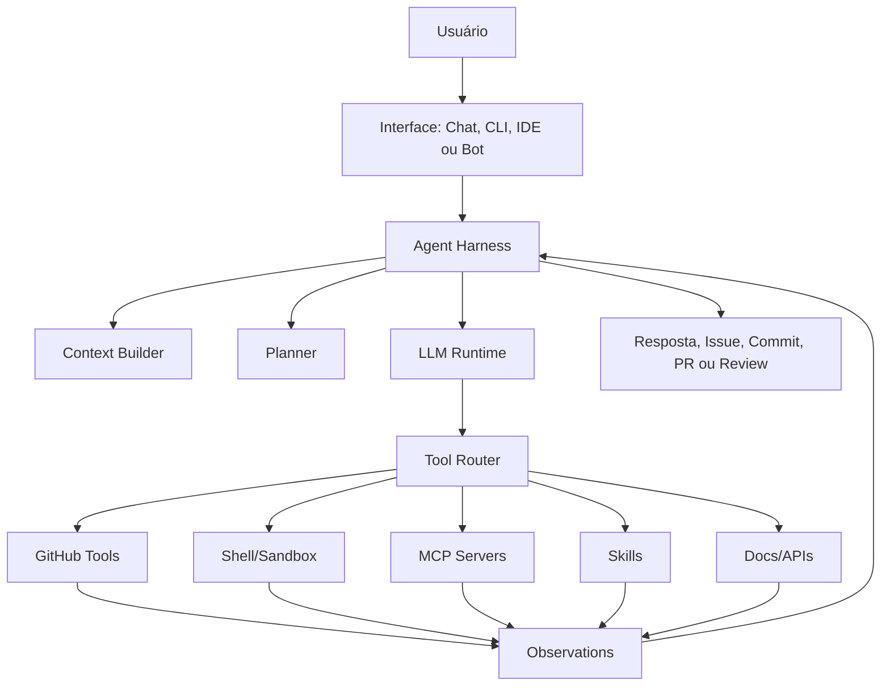
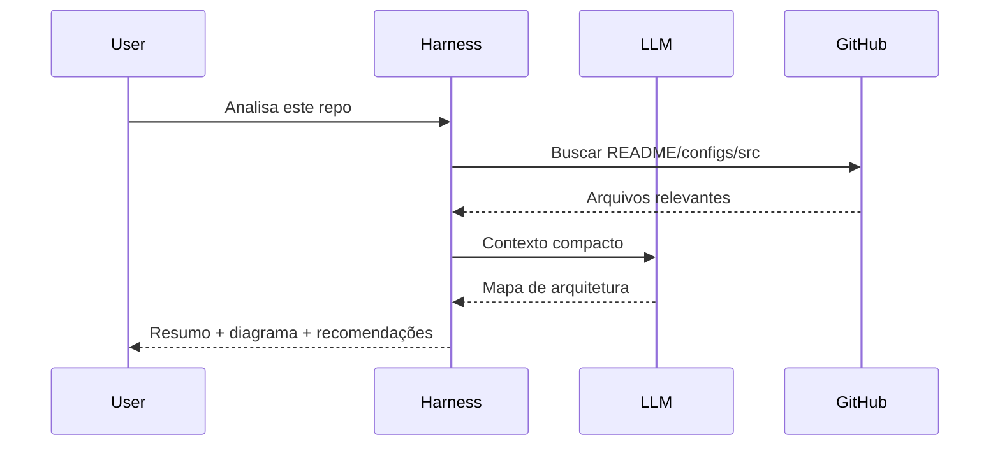
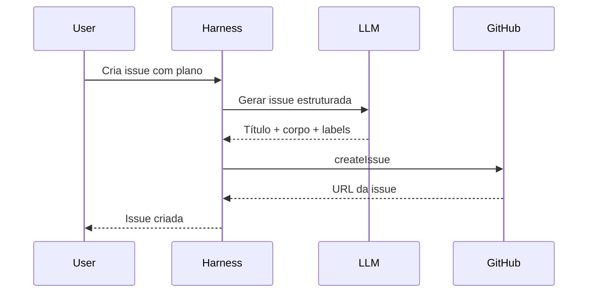
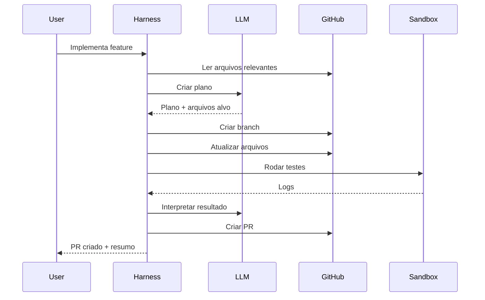

# Arquitetura: Agentic Chat Codex

> Um LLM no centro, um harness controlando o corpo, GitHub como sistema nervoso do código, tools/MCPs/skills como membros operacionais, e permissões como coleira anti-apocalipse.

Este documento descreve uma arquitetura para transformar um modelo cru de linguagem em um agente operacional capaz de conversar, raciocinar, usar ferramentas, manipular repositórios, executar fluxos e produzir artefatos como issues, commits, pull requests e reviews.

A ideia principal é simples: o modelo sozinho é texto entrando e texto saindo. O produto completo precisa de um harness, tools, memória, permissões, sandbox e integrações.

---

## 1. Visão geral



O ciclo principal é:

```text
entender intenção -> montar contexto -> planejar -> chamar tools -> observar resultado -> decidir próximo passo -> entregar artefato
```

---

## 2. Princípio central

### Modelo cru

```text
Texto entra -> texto sai
```

### Modelo com harness

```text
Texto entra
-> modelo raciocina
-> harness escolhe/autoriza ferramentas
-> agente lê arquivos/issues/PRs
-> agente executa comandos em sandbox
-> agente edita código
-> agente testa
-> agente cria issue/commit/PR/review
-> resposta final
```

O modelo é o motor. O harness é o carro inteiro: volante, freio, painel, airbag, estepe e aquele barulho estranho que só aparece na sexta-feira.

---

## 3. Componentes

### 3.1 Interface

Pode ser implementada como:

- Chat web
- CLI
- extensão do VS Code
- GitHub bot
- integração com Slack/Discord
- painel interno

Responsabilidades:

- receber a intenção do usuário
- exibir planos e resultados
- pedir confirmação quando necessário
- mostrar diffs, logs, issues e PRs

---

### 3.2 Agent Harness

O harness é o orquestrador principal.

Responsabilidades:

- controlar o loop do agente
- manter estado da tarefa
- montar contexto
- chamar o modelo
- rotear chamadas de ferramentas
- aplicar políticas de segurança
- registrar logs/auditoria
- transformar o resultado em artefato útil

```ts
export interface AgentHarness {
  run(task: UserTask): Promise<AgentResult>;
}

export interface UserTask {
  input: string;
  repo?: string;
  mode: "answer" | "plan" | "act";
}

export interface AgentResult {
  summary: string;
  artifacts: Artifact[];
  toolCalls: ToolCallLog[];
}
```

---

### 3.3 Context Builder

Monta o contexto certo sem socar o repositório inteiro no prompt igual mala de viagem voltando da praia.

Responsabilidades:

- ler README e configs
- buscar arquivos relevantes
- resumir estrutura do projeto
- recuperar issues/PRs relacionados
- montar um contexto compacto
- respeitar orçamento de tokens

```ts
export interface ContextBuilder {
  build(input: ContextInput): Promise<ModelContext>;
}

export interface ContextInput {
  task: UserTask;
  repo?: string;
  hints?: string[];
}

export interface ModelContext {
  system: string;
  developer?: string;
  user: string;
  repoSummary?: string;
  relevantFiles?: RelevantFile[];
}
```

---

### 3.4 Planner

Transforma pedidos vagos em plano executável.

Exemplo:

```text
Usuário: corrige o bug de login

Plano:
1. Buscar arquivos relacionados a login/auth
2. Ler testes existentes
3. Identificar fluxo quebrado
4. Propor alteração
5. Aplicar patch em branch
6. Rodar testes
7. Abrir PR
```

```ts
export interface Planner {
  createPlan(context: ModelContext): Promise<AgentPlan>;
}

export interface AgentPlan {
  goal: string;
  steps: AgentStep[];
  riskLevel: "low" | "medium" | "high";
}
```

---

### 3.5 LLM Runtime

Camada que conversa com o modelo.

Deve suportar múltiplos provedores:

- OpenAI/GPT
- Anthropic/Claude
- modelos locais
- roteamento por tarefa

```ts
export interface LLMRuntime {
  complete(input: LLMInput): Promise<LLMOutput>;
}

export interface LLMInput {
  messages: Message[];
  tools: ToolDefinition[];
  model: string;
}
```

---

### 3.6 Tool Router

Recebe uma intenção de tool call e executa a ferramenta correta.

```ts
export interface ToolRouter {
  call(name: string, input: unknown): Promise<ToolResult>;
}

export interface ToolDefinition {
  name: string;
  description: string;
  inputSchema: unknown;
  permissions: Permission[];
}
```

Tipos de ferramentas:

| Tipo | Exemplos | Função |
|---|---|---|
| GitHub Tools | buscar arquivo, criar issue, abrir PR | manipular repositório |
| Shell Tools | rodar testes, lint, build | validar execução |
| MCP Tools | banco, docs, observabilidade | integrar sistemas externos |
| Skills | workflows empacotados | repetir processos bem definidos |
| Browser/API Tools | pesquisar docs públicas, chamar serviços | obter contexto externo |

---

## 4. GitHub como sistema nervoso do agente

A integração com GitHub deve permitir:

- listar repositórios
- buscar código
- ler arquivos
- criar branches
- criar/atualizar arquivos
- abrir issues
- comentar issues/PRs
- abrir PRs
- revisar PRs
- consultar status de CI

```ts
export interface GitHubAdapter {
  searchCode(input: SearchCodeInput): Promise<SearchCodeResult[]>;
  fetchFile(input: FetchFileInput): Promise<RepositoryFile>;
  createIssue(input: CreateIssueInput): Promise<Issue>;
  createBranch(input: CreateBranchInput): Promise<Branch>;
  updateFile(input: UpdateFileInput): Promise<Commit>;
  createPullRequest(input: CreatePullRequestInput): Promise<PullRequest>;
  commentOnIssue(input: CommentInput): Promise<Comment>;
}
```

Fluxo ideal para alterações:

```text
nunca editar direto sem plano
nunca mergear sem confirmação
toda mudança significativa -> branch -> commit -> PR
```

---

## 5. Sandbox de execução

O agente precisa executar comandos, mas com limite. Terminal sem coleira vira filme de terror corporativo.

Responsabilidades:

- clonar/check out do repo
- instalar dependências quando autorizado
- rodar testes/lint/build
- capturar stdout/stderr
- aplicar timeout
- bloquear comandos perigosos
- isolar secrets e filesystem

```ts
export interface ExecutionSandbox {
  run(input: CommandInput): Promise<CommandResult>;
}

export interface CommandInput {
  command: string;
  cwd?: string;
  timeoutMs?: number;
}

export interface CommandResult {
  exitCode: number;
  stdout: string;
  stderr: string;
}
```

Comandos de alto risco devem exigir aprovação:

- `rm -rf`
- comandos com secrets
- deploy
- migração destrutiva
- alteração de infraestrutura
- merge/release

---

## 6. Policy Guard

Camada que decide o que pode ou não ser feito.

```ts
export interface PolicyGuard {
  canRead(resource: Resource): Promise<boolean>;
  canWrite(resource: Resource): Promise<boolean>;
  canRun(command: string): Promise<PolicyDecision>;
  requiresApproval(action: AgentAction): Promise<boolean>;
}

export interface PolicyDecision {
  allowed: boolean;
  reason?: string;
  requiresApproval?: boolean;
}
```

Regras recomendadas:

- leitura de arquivos públicos/autorizados: permitido
- criação de issue: permitido em modo `act`
- criação de PR: permitido após plano
- merge: sempre exige confirmação
- deletar arquivo: exige confirmação
- comandos destrutivos: bloqueados ou confirmação explícita
- secrets: nunca expor no prompt final

---

## 7. Skills

Skills são fluxos reutilizáveis.

Exemplos:

```text
skills/
├── analyze-repo/
├── create-architecture-doc/
├── fix-failing-test/
├── review-pr/
├── generate-pr-description/
└── create-feature-plan/
```

Uma skill deve ter:

```text
skill.md
scripts/
templates/
examples/
```

Exemplo de skill:

```md
# analyze-repo

## Objetivo
Analisar um repositório e produzir mapa de arquitetura.

## Entrada
- repo
- branch/ref opcional
- objetivo do usuário

## Processo
1. Ler README
2. Detectar stack
3. Mapear diretórios
4. Identificar entrypoints
5. Gerar diagrama

## Saída
- resumo
- riscos
- recomendações
- diagrama Mermaid
```

---

## 8. MCPs

MCPs funcionam como conectores padronizados para sistemas externos.

Possíveis servidores:

```text
mcp.github
mcp.filesystem
mcp.postgres
mcp.linear
mcp.slack
mcp.docs
mcp.observability
mcp.deploy
```

No harness, MCP entra como mais uma família de tools:

```text
Tool Router
├── native tools
├── GitHub adapter
├── MCP client
└── skill runner
```

---

## 9. Estrutura sugerida do projeto

```text
agentic-chat-codex/
├── src/
│   ├── agent/
│   │   ├── AgentHarness.ts
│   │   ├── AgentController.ts
│   │   ├── Planner.ts
│   │   ├── StepRunner.ts
│   │   └── Memory.ts
│   │
│   ├── context/
│   │   ├── ContextBuilder.ts
│   │   ├── RepoSummarizer.ts
│   │   └── TokenBudget.ts
│   │
│   ├── llm/
│   │   ├── LLMRuntime.ts
│   │   ├── OpenAIClient.ts
│   │   ├── AnthropicClient.ts
│   │   └── ModelRouter.ts
│   │
│   ├── tools/
│   │   ├── ToolRegistry.ts
│   │   ├── ToolRouter.ts
│   │   ├── github/
│   │   │   ├── GitHubAdapter.ts
│   │   │   ├── searchCode.ts
│   │   │   ├── fetchFile.ts
│   │   │   ├── createIssue.ts
│   │   │   └── createPullRequest.ts
│   │   ├── shell/
│   │   │   └── runCommand.ts
│   │   └── mcp/
│   │       └── MCPClient.ts
│   │
│   ├── policies/
│   │   ├── PolicyGuard.ts
│   │   ├── PermissionModel.ts
│   │   └── ApprovalGate.ts
│   │
│   ├── sandbox/
│   │   └── ExecutionSandbox.ts
│   │
│   └── output/
│       ├── MarkdownRenderer.ts
│       ├── IssueWriter.ts
│       └── PullRequestWriter.ts
│
├── prompts/
│   ├── system.md
│   ├── planner.md
│   ├── code-review.md
│   └── pr-description.md
│
├── skills/
│   ├── analyze-repo/
│   ├── create-feature/
│   └── fix-test/
│
├── docs/
│   └── ARCHITECTURE.md
│
└── README.md
```

---

## 10. Fluxos principais

### 10.1 Analisar repositório



---

### 10.2 Criar issue



---

### 10.3 Implementar mudança



---

## 11. Modos de operação

### `answer`

Só responde. Não escreve no GitHub.

### `plan`

Lê contexto e produz plano. Pode criar issue se autorizado.

### `act`

Pode criar branch, editar arquivos e abrir PR conforme permissões.

### `review`

Analisa PRs, comenta riscos e sugere melhorias.

---

## 12. Observabilidade

Todo agente sério precisa deixar rastro. Sem log, é só feitiçaria com JSON.

Registrar:

- prompt/contexto resumido
- tool calls
- tempo de execução
- arquivos lidos
- arquivos modificados
- comandos executados
- decisões bloqueadas pelo policy guard
- aprovação humana
- resultado final

```ts
export interface ToolCallLog {
  id: string;
  toolName: string;
  inputSummary: string;
  outputSummary: string;
  startedAt: string;
  finishedAt: string;
  status: "success" | "error" | "blocked";
}
```

---

## 13. Roadmap recomendado

### MVP

- Chat/CLI simples
- GitHub read-only
- Context Builder básico
- LLM com tool calling
- Criação de issues
- Geração de arquitetura/planos

### V2

- Criação de branch
- Escrita de arquivos
- Pull requests
- Sandbox para testes
- Policy Guard inicial

### V3

- Skills reutilizáveis
- MCP client
- Memória por projeto
- Revisão automática de PR
- Logs/auditoria

### V4

- Agente multi-step robusto
- Aprovação humana granular
- CI integration
- Auto-fix de testes quebrados
- Métricas de qualidade
- Integração com IDE

---

## 14. Critérios de aceite

- O agente consegue explicar a arquitetura atual de um repo.
- O agente consegue criar uma issue estruturada com plano técnico.
- O agente consegue buscar e ler arquivos relevantes no GitHub.
- O agente consegue operar em modo seguro sem escrita por padrão.
- Toda escrita relevante acontece via branch e PR.
- Comandos destrutivos são bloqueados ou exigem aprovação.
- Logs de tool calls ficam auditáveis.
- O usuário entende o que foi feito, onde foi feito e por quê.

---

## 15. Frase de projeto

Agentic Chat Codex é um harness para transformar LLMs em agentes de desenvolvimento: modelos raciocinam, tools executam, políticas controlam, GitHub registra, e o usuário continua mandando no volante.
