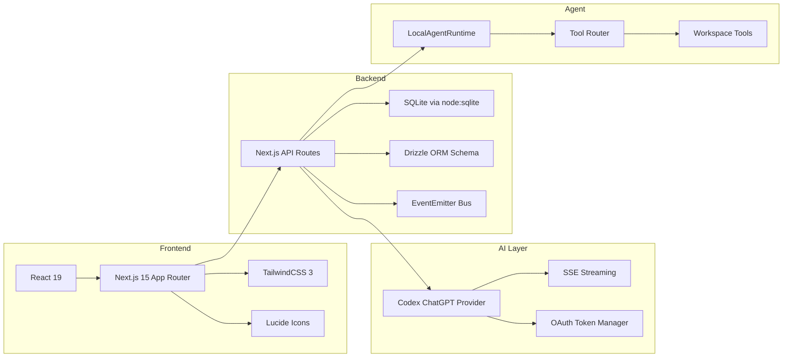
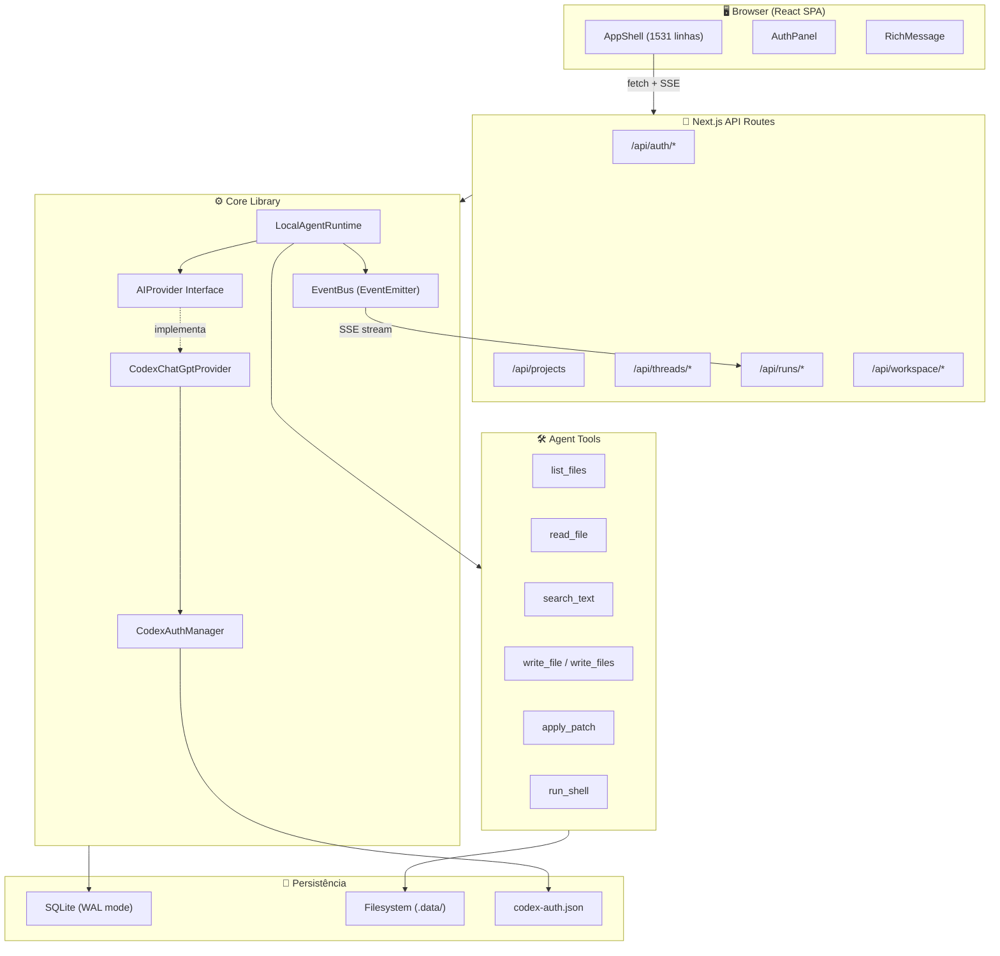
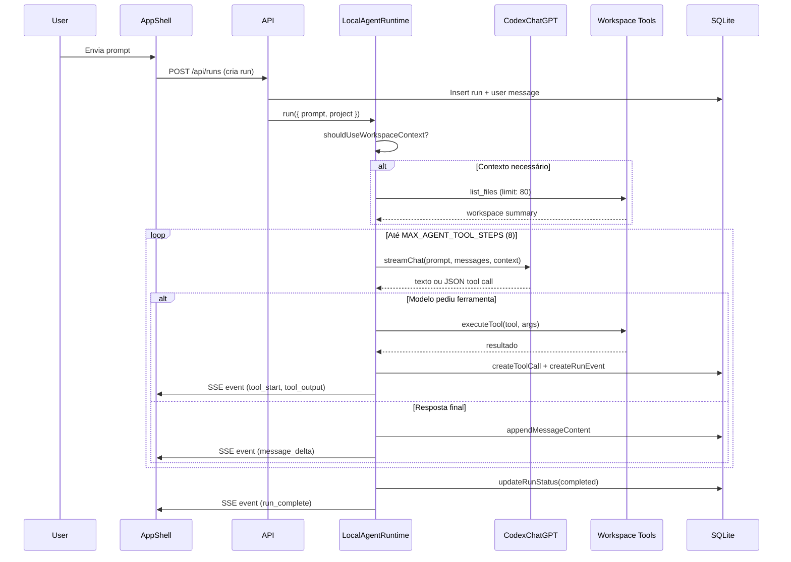
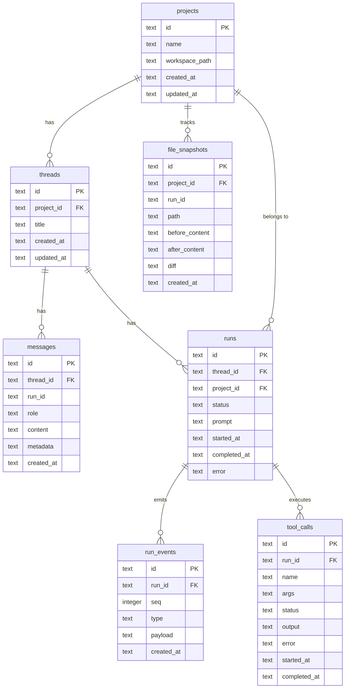

# Análise Ampliada — Agentic Chat Codex

> Análise técnica completa do repositório, cobrindo arquitetura, qualidade, segurança, testes e recomendações de melhoria.

---

## 1. Resumo Executivo

| Métrica | Valor |
|---|---|
| **Nome** | `agentic-chat-codex-style` |
| **Versão** | `0.1.0` |
| **Commits** | 2 |
| **Arquivos fonte** (`src/`) | 39 arquivos TypeScript/TSX |
| **Tamanho fonte** | ~194 KB |
| **Arquivos de teste** | 11 (unit + e2e) |
| **Tamanho testes** | ~30 KB |
| **README** | ❌ **Ausente** |
| **Documentação** | `docs/ARCHITECTURE.md` + doc avulsa na raiz |
| **Stack** | Next.js 15 · React 19 · TailwindCSS 3 · SQLite · Drizzle ORM |
| **LLM Provider** | Codex ChatGPT (SSE streaming via `chatgpt.com/backend-api`) |

> [!WARNING]
> O projeto não possui `README.md`. Isso é **crítico** para qualquer repositório público ou de equipe — sem README, colaboradores não conseguem entender, instalar ou contribuir com o projeto.

---

## 2. Stack Tecnológica



### Dependências de Produção

| Pacote | Versão | Função |
|---|---|---|
| `next` | ^15.0.0 | Framework web fullstack |
| `react` / `react-dom` | ^19.0.0 | UI rendering |
| `drizzle-orm` | ^0.44.0 | ORM tipado (schema only — queries são raw SQL) |
| `lucide-react` | ^0.468.0 | Ícones SVG |
| `diff` | ^7.0.0 | Unified diff generation + patch application |

### Dependências de Desenvolvimento

| Pacote | Função |
|---|---|
| `vitest` ^2.1.8 | Unit tests |
| `@playwright/test` ^1.49.0 | E2E tests |
| `@testing-library/jest-dom` ^6.6.3 | DOM matchers |
| `tailwindcss` ^3.4.17 | CSS utility framework |
| `typescript` ^5.7.0 | Type checking |
| `eslint` + `eslint-config-next` | Linting |

---

## 3. Arquitetura do Sistema



---

## 4. Mapa de Módulos

### 4.1 Frontend (`src/components/`)

| Arquivo | Linhas | Responsabilidade |
|---|---|---|
| [app-shell.tsx](file:///c:/Users/Larri/Documents/agentic-chat-codex/src/components/app-shell.tsx) | **1531** | Componente monolítico: sidebar, chat, composer, painéis laterais, SSE, estado global |
| [auth-panel.tsx](file:///c:/Users/Larri/Documents/agentic-chat-codex/src/components/auth-panel.tsx) | 385 | Painel de auth: import, device login, usage display |
| [rich-message.tsx](file:///c:/Users/Larri/Documents/agentic-chat-codex/src/components/rich-message.tsx) | 467 | Renderizador markdown custom: headings, listas, tabelas, code blocks, inline formatting |

> [!IMPORTANT]
> O `app-shell.tsx` com **1531 linhas e 55 KB** é o maior risco de manutenção do projeto. Ele concentra toda a lógica de UI, estado, fetching, SSE e rendering numa única função React.

### 4.2 Agent Runtime (`src/lib/agent/`)

| Arquivo | Linhas | Responsabilidade |
|---|---|---|
| [runtime.ts](file:///c:/Users/Larri/Documents/agentic-chat-codex/src/lib/agent/runtime.ts) | 587 | Loop do agente: parse de tool calls, execução sequencial, integração com LLM |
| [tools.ts](file:///c:/Users/Larri/Documents/agentic-chat-codex/src/lib/agent/tools.ts) | 241 | 7 ferramentas locais: list, read, search, write, write_files, patch, shell |
| [path-guard.ts](file:///c:/Users/Larri/Documents/agentic-chat-codex/src/lib/agent/path-guard.ts) | 72 | Sandbox de filesystem: impede traversal fora do workspace |
| [diff.ts](file:///c:/Users/Larri/Documents/agentic-chat-codex/src/lib/agent/diff.ts) | 13 | Wrapper para `createTwoFilesPatch` |

### 4.3 AI Provider (`src/lib/ai/`)

| Arquivo | Linhas | Responsabilidade |
|---|---|---|
| [provider.ts](file:///c:/Users/Larri/Documents/agentic-chat-codex/src/lib/ai/provider.ts) | 21 | Interface `AIProvider` + tipos |
| [codex-chatgpt-provider.ts](file:///c:/Users/Larri/Documents/agentic-chat-codex/src/lib/ai/codex-chatgpt-provider.ts) | 339 | Implementação: payload builder, SSE parser, content parts (input_text/input_image) |
| [index.ts](file:///c:/Users/Larri/Documents/agentic-chat-codex/src/lib/ai/index.ts) | 11 | Factory function |

### 4.4 Auth (`src/lib/codex/`)

| Arquivo | Linhas | Responsabilidade |
|---|---|---|
| [auth-manager.ts](file:///c:/Users/Larri/Documents/agentic-chat-codex/src/lib/codex/auth-manager.ts) | **771** | OAuth completo: multi-account, refresh, device flow, usage, scoring, merge |

### 4.5 Database (`src/lib/db/`)

| Arquivo | Linhas | Responsabilidade |
|---|---|---|
| [client.ts](file:///c:/Users/Larri/Documents/agentic-chat-codex/src/lib/db/client.ts) | 143 | SQLite bootstrap: migrations inline, singleton global, WAL mode |
| [schema.ts](file:///c:/Users/Larri/Documents/agentic-chat-codex/src/lib/db/schema.ts) | 97 | Drizzle ORM schema (projects, threads, messages, runs, run_events, tool_calls, file_snapshots) |
| [repositories.ts](file:///c:/Users/Larri/Documents/agentic-chat-codex/src/lib/db/repositories.ts) | 514 | CRUD completo para todas as 7 tabelas |

### 4.6 Utilitários

| Arquivo | Linhas | Responsabilidade |
|---|---|---|
| [workspace-manager.ts](file:///c:/Users/Larri/Documents/agentic-chat-codex/src/lib/workspace-manager.ts) | 164 | Layout do workspace, upload de arquivos, forbidden paths |
| [attachments.ts](file:///c:/Users/Larri/Documents/agentic-chat-codex/src/lib/attachments.ts) | 89 | Classificação de anexos (image/text/pdf), limites |
| [pdf-text.ts](file:///c:/Users/Larri/Documents/agentic-chat-codex/src/lib/pdf-text.ts) | 150 | Extração de texto de PDFs (zero dependencies externas) |
| [http.ts](file:///c:/Users/Larri/Documents/agentic-chat-codex/src/lib/http.ts) | 12 | Helpers de NextResponse |
| [utils.ts](file:///c:/Users/Larri/Documents/agentic-chat-codex/src/lib/utils.ts) | 38 | ID generation, ISO dates, JSON parse, text clamping |
| [types.ts](file:///c:/Users/Larri/Documents/agentic-chat-codex/src/lib/types.ts) | 154 | Todas as interfaces/types do domínio |
| [events/event-bus.ts](file:///c:/Users/Larri/Documents/agentic-chat-codex/src/lib/events/event-bus.ts) | 27 | Pub/sub via `EventEmitter` global |
| [events/sse.ts](file:///c:/Users/Larri/Documents/agentic-chat-codex/src/lib/events/sse.ts) | 7 | Formatação SSE |

### 4.7 API Routes (`src/app/api/`)

| Rota | Métodos | Função |
|---|---|---|
| `/api/auth/status` | GET | Status das contas Codex |
| `/api/auth/import` | POST | Importar auth.json |
| `/api/auth/device/*` | POST | Device login flow |
| `/api/auth/usage/*` | POST | Refresh de usage/quota |
| `/api/projects` | GET, POST | CRUD de projetos |
| `/api/threads` | GET, POST | CRUD de threads |
| `/api/threads/[threadId]` | GET | Thread + messages + runs |
| `/api/runs/[runId]/*` | GET, POST | Criar run, SSE de eventos |
| `/api/workspace/tree` | GET | Árvore de arquivos |
| `/api/workspace/file` | GET | Conteúdo de arquivo |
| `/api/workspace/write` | POST | Escrita no workspace |

---

## 5. Fluxo do Agente



### Mecanismo de Tool Calling

O sistema usa **JSON-over-text** — o LLM responde com JSON puro quando quer chamar ferramentas:

```json
// Uma ferramenta
{"tool":"read_file","args":{"path":"README.md"}}

// Várias ferramentas
{"tools":[
  {"tool":"write_file","args":{"path":"a.txt","content":"A"}},
  {"tool":"write_file","args":{"path":"b.txt","content":"B"}}
]}
```

Também suporta comandos explícitos via prefixo: `/read`, `/search`, `/shell`, `/write`, `/patch`.

---

## 6. Avaliação de Qualidade

### 6.1 Pontos Fortes ✅

| Aspecto | Detalhe |
|---|---|
| **Tipagem** | TypeScript strict em todo o projeto |
| **Segurança de paths** | `WorkspaceGuard` impede directory traversal |
| **Workspace isolation** | `isForbiddenWorkspacePath` bloqueia acesso a `src/`, `.next/`, `node_modules/` |
| **SSE real-time** | Streaming de eventos via EventEmitter → SSE nativo |
| **Multi-account auth** | Suporte a múltiplas contas Codex com scoring e auto-refresh |
| **Device login flow** | OAuth device flow completo |
| **PDF processing** | Extração de texto sem dependências externas |
| **Testes unitários** | 10 arquivos de teste com boa cobertura dos módulos core |
| **Testes E2E** | Playwright configurado com web server auto-start |
| **Design system** | Paleta de cores coerente (ink/paper/teal/berry/amber) |
| **Responsive** | Viewport handling dinâmico, breakpoints mobile |

### 6.2 Problemas Identificados 🔴

#### Críticos

| # | Problema | Impacto |
|---|---|---|
| 1 | **Sem README.md** | Impossível onboarding de qualquer desenvolvedor |
| 2 | **`app-shell.tsx` monolítico (1531 linhas)** | Unmaintainable — estado, UI, fetching e SSE numa única função |
| 3 | **Tokens OAuth em plaintext** (`codex-auth.json`) | Risco de exposição de credenciais |
| 4 | **Sem rate limiting nas API routes** | Vulnerable a abuse/DoS |
| 5 | **Sem validação de input nas APIs** | Qualquer JSON é aceito sem sanitização |

#### Moderados

| # | Problema | Impacto |
|---|---|---|
| 6 | **Sem Error Boundaries React** | Crash em um componente derruba a aplicação inteira |
| 7 | **Funções duplicadas** (`classNames`, `copyToClipboard`, `fetchJson`) em múltiplos arquivos | Violação de DRY |
| 8 | **Drizzle ORM importado mas não usado para queries** | Schema definido duas vezes (Drizzle + migrations inline no client) |
| 9 | **Sem logging estruturado** | Debug em produção depende de console |
| 10 | **Sem CI/CD** | Nenhum GitHub Actions, nenhuma pipeline |
| 11 | **Auth manager com 771 linhas** | Demasiadas responsabilidades num único arquivo |

#### Menores

| # | Problema | Impacto |
|---|---|---|
| 12 | **Strings de UI hardcoded** (mix PT-BR/EN) | Sem i18n, inconsistência linguística |
| 13 | **Sem `.env` validation** | Variáveis de ambiente não são validadas no boot |
| 14 | **`postcss.config.mjs` sem `tailwind/nesting`** | Limitação de CSS nesting |
| 15 | **Sem favicon/meta tags completas** | SEO/branding mínimo |

### 6.3 Cobertura de Testes

| Módulo | Testes | Status |
|---|---|---|
| `auth-manager` | ✅ auth-manager.test.ts | Coberto |
| `provider` | ✅ provider.test.ts | Coberto |
| `repositories` | ✅ repositories.test.ts | Coberto |
| `path-guard` | ✅ path-guard.test.ts | Coberto |
| `workspace-manager` | ✅ workspace-manager.test.ts | Coberto |
| `runtime-history` | ✅ runtime-history.test.ts | Coberto |
| `rich-message` | ✅ rich-message.test.ts | Coberto |
| `sse` | ✅ sse.test.ts | Coberto |
| `attachments` | ✅ attachments.test.ts | Coberto |
| `pdf-text` | ✅ pdf-text.test.ts | Coberto |
| `runtime (agent loop)` | ❌ | **Não coberto** |
| `codex-chatgpt-provider` | ❌ | **Não coberto** (testado indiretamente via provider.test) |
| `app-shell` | ❌ | **Não coberto** (1531 linhas sem teste) |
| `API routes` | ⚠️ | Coberto parcialmente pelo E2E |

---

## 7. Modelo de Dados



---

## 8. Roadmap de Melhorias

### Prioridade 1 — Fundação

- [ ] **Criar README.md** profissional com setup, arquitetura, screenshots
- [ ] **Decompor `app-shell.tsx`** em ~8 componentes (Sidebar, ChatView, Composer, SidePanel, FileExplorer, RunLog, DiffViewer, OptionsPanel)
- [ ] **Extrair funções duplicadas** (`classNames`, `copyToClipboard`, `fetchJson`) para `src/lib/ui-utils.ts`
- [ ] **Adicionar Error Boundary** no layout root

### Prioridade 2 — Segurança

- [ ] **Encriptar `codex-auth.json`** com Fernet ou AES-256-GCM
- [ ] **Rate limiting** nas API routes (in-memory ou middleware)
- [ ] **Input validation** com schema (Zod) em todas as rotas POST
- [ ] **CORS configurado** no `next.config.ts`
- [ ] **Sanitizar outputs** do shell antes de armazenar

### Prioridade 3 — Qualidade

- [ ] **Testes para `runtime.ts`** (agent loop) — módulo mais crítico sem cobertura
- [ ] **Remover schema duplicado** — usar Drizzle para queries ou remover o ORM
- [ ] **Validação de `.env`** no boot (Zod schema para env vars)
- [ ] **Logging estruturado** (pino ou winston)
- [ ] **GitHub Actions** para CI (typecheck + test + build)

### Prioridade 4 — Features

- [ ] **Múltiplos providers LLM** (Anthropic, OpenAI API key, local)
- [ ] **Syntax highlighting** nos code blocks (shiki ou prism)
- [ ] **Markdown preview melhorado** com syntax-aware rendering
- [ ] **Export de conversas** (JSON/Markdown)
- [ ] **Tema dark** nativo (já tem a base de design system)

---

## 9. Conclusão

O projeto tem uma **base técnica sólida** — tipagem estrita, arquitetura de agente funcional, SSE real-time, sistema de auth multi-conta sofisticado e uma suite de testes respeitável para o estágio atual. O extrator de PDF zero-dependency e o path guard são exemplos de engenharia cuidadosa.

Os **riscos principais** são o componente monolítico `app-shell.tsx` (que vai se tornar ingerenciável rapidamente), a ausência de README, e credenciais em plaintext. Esses três itens devem ser endereçados antes de qualquer feature nova.

> **Veredicto**: Projeto em estágio alpha funcional. Precisa de refatoração estrutural, hardening de segurança e documentação para escalar.
